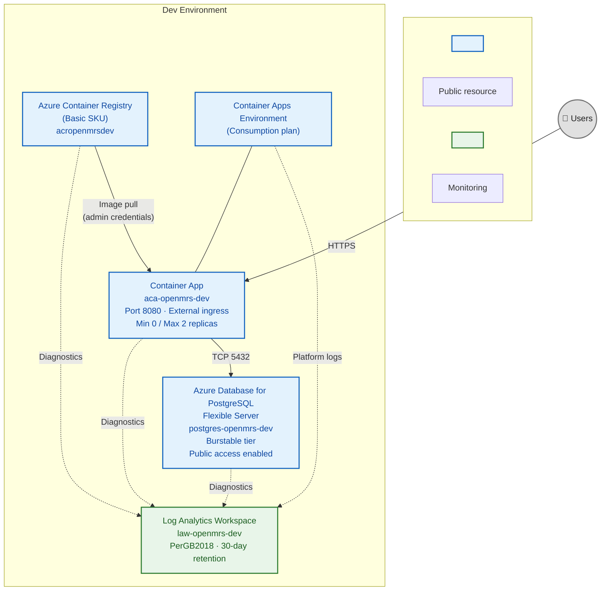
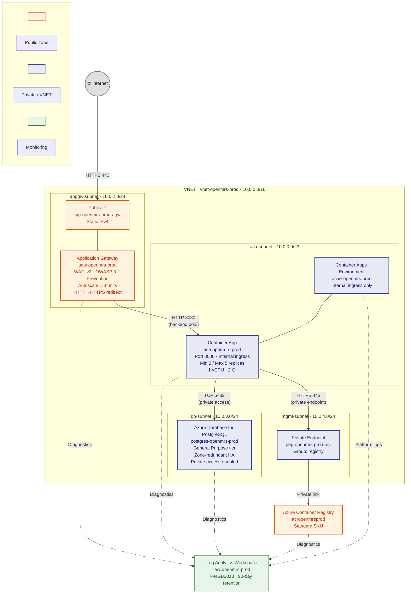

# OpenMRS Core — Azure Architecture Diagrams

> **📐 Draw.io**: [azure-architecture.drawio](./azure-architecture.drawio) — open with [draw.io](https://app.diagrams.net) or VS Code draw.io extension

> These diagrams document the Azure Container Apps architecture for OpenMRS Core
> across the **dev** and **prod** environments. Resource names, CIDR ranges, and
> network rules are sourced from the Bicep IaC definitions in
> `infrastructure/environments/`.

---

## 1. Development Environment Architecture

The dev environment prioritises simplicity and cost efficiency. All resources use
public networking with no VNET integration. The Container App scales to zero when
idle and is directly accessible over the Internet.

**Legend**

| Colour | Meaning |
|--------|---------|
| 🔵 Blue | Public Azure resource (Internet-accessible) |
| 🟢 Green | Monitoring / observability resource |
| Solid arrow | Data-plane traffic |
| Dashed arrow | Diagnostics / telemetry |

---

## 2. Production Environment Architecture

The production environment is fully network-isolated. All traffic enters through
an Application Gateway with WAF v2 in Prevention mode. Backend services
(Container App, PostgreSQL, ACR) are reachable only via private networking inside a
dedicated VNET. The Container App runs a minimum of 2 replicas for high
availability and the database uses zone-redundant HA.

**Legend**

| Colour | Meaning |
|--------|---------|
| 🟠 Orange | Public-facing resource (Internet-exposed) |
| 🔵 Indigo | Private / VNET-isolated resource |
| 🟢 Green | Monitoring / observability resource |
| Solid arrow | Data-plane traffic |
| Dashed arrow | Diagnostics / telemetry |

**NSG rules (summary)**

| NSG | Key inbound rules | Key outbound rules |
|-----|--------------------|--------------------|
| `nsg-openmrs-prod-appgw` | Allow Internet → 80, 443 | Allow → ACA subnet 8080 |
| `nsg-openmrs-prod-aca` | Allow AppGW subnet → 8080 | Allow → Internet 443 (HTTPS) |
| `nsg-openmrs-prod-db` | Allow ACA subnet → 5432 | — |
| `nsg-openmrs-prod-mgmt` | Allow ACA subnet → 443 (PE) | — |

---

## 3. Network Topology

This diagram focuses on the VNET structure, subnet boundaries, traffic flows,
and NSG enforcement in the production environment.

```mermaid
graph LR
    subgraph legend [" "]
        direction TB
        lp[" "]:::publicFlow
        lpt["Public traffic"]
        li[" "]:::internalFlow
        lit["Internal traffic"]
        lpe[" "]:::peFlow
        lpet["Private endpoint"]
    end

    Internet(("🌐 Internet")):::external

    subgraph VNET ["VNET · 10.0.0.0/16"]

        subgraph appgwSn ["appgw-subnet · 10.0.2.0/24\nNSG: nsg-openmrs-prod-appgw"]
            PIP["Public IP\nStatic IPv4"]:::publicNode
            AGW["Application Gateway\nWAF_v2"]:::publicNode
        end

        subgraph acaSn ["aca-subnet · 10.0.0.0/23\nNSG: nsg-openmrs-prod-aca\nDelegation: Microsoft.App/environments"]
            ACA["Container App\nInternal ingress\nPort 8080"]:::privateNode
        end

        subgraph dbSn ["db-subnet · 10.0.3.0/24\nNSG: nsg-openmrs-prod-db"]
            DB["PostgreSQL Flexible Server\nPrivate access enabled"]:::privateNode
        end

        subgraph mgmtSn ["mgmt-subnet · 10.0.4.0/24\nNSG: nsg-openmrs-prod-mgmt"]
            PE_ACR["PE: ACR\nregistry"]:::peNode
        end
    end

    ACR_EXT["Azure Container\nRegistry"]:::externalService

    Internet -->|"HTTPS 443\nHTTP 80 → 301 redirect"| PIP
    PIP --- AGW
    AGW -->|"HTTP 8080\nAllowed by NSG priority 120"| ACA
    ACA -->|"HTTPS 443\nAllowed by NSG priority 100"| PE_ACR
    ACA -->|"TCP 5432\nprivate access"| DB
    PE_ACR -.-|"Private link"| ACR_EXT

    classDef external fill:#e0e0e0,stroke:#757575,stroke-width:2px,color:#212121
    classDef publicNode fill:#FFF3E0,stroke:#E65100,stroke-width:2px,color:#BF360C
    classDef privateNode fill:#E8EAF6,stroke:#283593,stroke-width:2px,color:#1A237E
    classDef peNode fill:#F3E5F5,stroke:#6A1B9A,stroke-width:2px,color:#4A148C
    classDef externalService fill:#ECEFF1,stroke:#546E7A,stroke-width:2px,color:#263238
    classDef publicFlow fill:#FFF3E0,stroke:#E65100
    classDef internalFlow fill:#E8EAF6,stroke:#283593
    classDef peFlow fill:#F3E5F5,stroke:#6A1B9A
```

**Legend**

| Colour | Meaning |
|--------|---------|
| 🟠 Orange | Public-facing node |
| 🔵 Indigo | Private / VNET-internal node |
| 🟣 Purple | Private endpoint NIC |
| ⬜ Grey | External service (outside VNET) |

**NSG rule detail**

| NSG | Rule | Priority | Protocol | Source | Destination | Port | Action |
|-----|------|----------|----------|--------|-------------|------|--------|
| `nsg-openmrs-prod-appgw` | allow-internet-https | 100 | TCP | Internet | * | 443 | Allow |
| `nsg-openmrs-prod-appgw` | allow-internet-http | 110 | TCP | Internet | * | 80 | Allow |
| `nsg-openmrs-prod-appgw` | allow-appgw-to-aca | 120 | TCP | 10.0.2.0/24 | 10.0.0.0/23 | 8080 | Allow |
| `nsg-openmrs-prod-aca` | allow-appgw-to-aca-8080 | 100 | TCP | 10.0.2.0/24 | * | 8080 | Allow |
| `nsg-openmrs-prod-aca` | allow-aca-outbound-https | 110 | TCP | * | Internet | 443 | Allow |
| `nsg-openmrs-prod-db` | allow-aca-to-db-5432 | 100 | TCP | 10.0.0.0/23 | * | 5432 | Allow |
| `nsg-openmrs-prod-mgmt` | allow-aca-to-pe-443 | 100 | TCP | 10.0.0.0/23 | * | 443 | Allow |

**Subnet summary**

| Subnet | CIDR | Purpose | Delegation |
|--------|------|---------|------------|
| `appgw-subnet` | 10.0.2.0/24 (256 IPs) | Application Gateway WAF_v2 | — |
| `aca-subnet` | 10.0.0.0/23 (512 IPs) | Container Apps Environment | `Microsoft.App/environments` |
| `db-subnet` | 10.0.3.0/24 (256 IPs) | PostgreSQL Flexible Server | — |
| `mgmt-subnet` | 10.0.4.0/24 (256 IPs) | Private endpoints (ACR, other private services) | — |

---

## Authoritative Diagrams

The authoritative architecture diagrams are maintained as draw.io files in this repository:

> **📐 [azure-architecture.drawio](./azure-architecture.drawio)** — open with [draw.io](https://app.diagrams.net) or VS Code draw.io extension

The draw.io document contains three pages:

1. **Dev Environment** — Simple ACA deployment with public ingress and PostgreSQL
2. **Production Environment** — Fully isolated VNET with Application Gateway, private endpoints, and NSG rules
3. **Network Topology** — Subnet layout, CIDR ranges, and traffic flow paths

The Mermaid diagrams above provide inline text-based views for quick reference and version control diffs.
