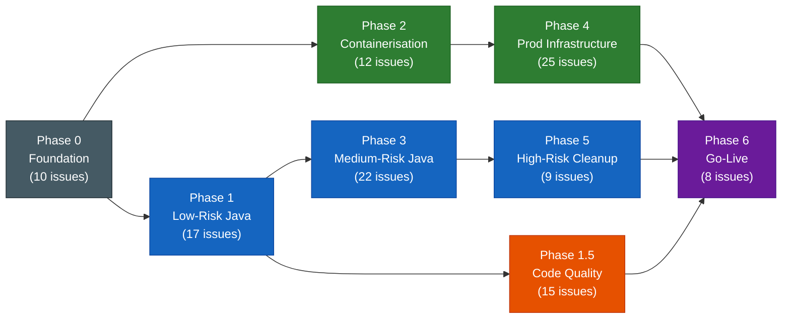
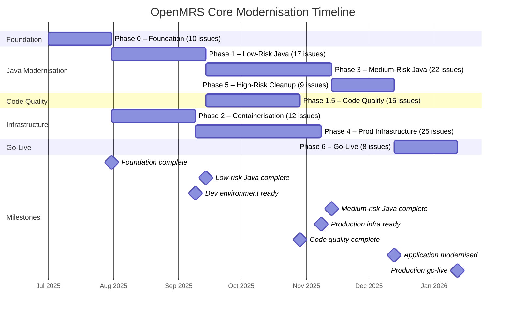
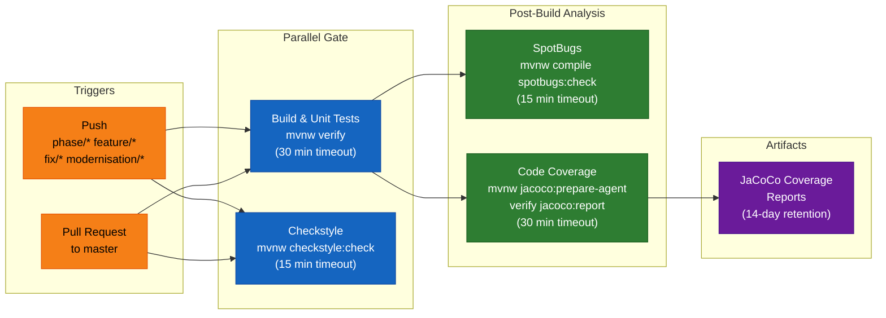

# Modernisation Flow Diagrams

> **📐 Draw.io**: [modernisation-flow.drawio](./modernisation-flow.drawio) — open with [draw.io](https://app.diagrams.net) or VS Code draw.io extension

> **Parent**: [Migration Phases](../modernisation-plan/05-migration-phases.md) | **Work Item**: #88

This document contains baseline Mermaid diagrams for the OpenMRS Core modernisation programme.
Four views are provided: phase dependencies, timeline, CI pipeline, and future deployment pipeline.

---

## 1. Phase Dependency Graph

Shows all eight phases, their dependency arrows, issue counts, and the two parallel tracks
(Java modernisation in blue, Infrastructure in green, Code quality in orange).
The critical path runs Phase 0 → 1 → 3 → 5 → 6.

**Legend**

| Colour | Track |
|--------|-------|
| Dark grey | Foundation (Phase 0) |
| Blue | Java modernisation (Phases 1, 3, 5) |
| Green | Infrastructure (Phases 2, 4) |
| Orange | Code quality (Phase 1.5) |
| Purple | Convergence (Phase 6) |

**Critical path**: Phase 0 → Phase 1 → Phase 3 → Phase 5 → Phase 6

**Parallel tracks**: Phase 1.5 runs in parallel with Phase 2 after Phase 1 completes. Phase 1 and Phase 2 run in parallel after Phase 0 completes.

---

## 2. Phase Timeline (Gantt)

Shows relative phase durations and sequencing. Phases on parallel tracks overlap on the timeline.
Durations are planning estimates — actual elapsed time will depend on team capacity and review cycles.

> **Note**: Phase 6 depends on Phases 4, 5, and 1.5. The Gantt `after` keyword only accepts a single
> predecessor, so Phase 6 is shown after Phase 5. In practice, Phase 6 cannot start until all three
> predecessors are complete.

---

## 3. CI/CD Pipeline Flow

Shows the GitHub Actions pipeline defined in
[`.github/workflows/ci-modernisation.yml`](../../.github/workflows/ci-modernisation.yml).
Build and Checkstyle run in parallel. SpotBugs and Coverage depend on a successful build.

**Pipeline details**

| Job | Runs after | Key command | Timeout |
|-----|-----------|-------------|---------|
| Build & Unit Tests | trigger | `./mvnw verify -B -ntp -Dspotbugs.skip=true` | 30 min |
| Checkstyle | trigger (parallel) | `./mvnw checkstyle:check -B -ntp` | 15 min |
| SpotBugs | Build | `./mvnw compile spotbugs:check -B -ntp` | 15 min |
| Code Coverage | Build | `./mvnw jacoco:prepare-agent verify jacoco:report -B -ntp` | 30 min |

**Environment**: Java 21 (Temurin), Maven cache enabled, concurrency group per workflow/ref with cancel-in-progress.

---

## 4. Deployment Pipeline (Future State)

Shows the target deployment flow from CI through to production on Azure.
This pipeline will be implemented across Phases 2 and 4.
An approval gate separates the dev and production deployment paths.

```mermaid
graph LR
    subgraph "CI Pipeline"
        SRC["Source Code\nGitHub"]
        CI["CI Checks\nBuild · Checkstyle\nSpotBugs · Coverage"]
    end

    subgraph "Container Build"
        DOCKER["Docker Build\nMulti-stage\nDockerfile"]
        ACR["ACR Push\nAzure Container\nRegistry"]
    end

    subgraph "Dev Deployment"
        DEV_ACA["Dev ACA\nAzure Container\nApps (dev)"]
        SMOKE["Smoke Tests\nHealth · API\nEndpoints"]
    end

    subgraph "Approval Gate"
        APPROVE{{"Manual\nApproval"}}
    end

    subgraph "Prod Deployment"
        PROD_APPGW["Application\nGateway v2\n+ WAF"]
        PROD_ACA["Prod ACA\nAzure Container\nApps (prod)\nVNET-integrated"]
        MONITOR["Monitoring\nDashboards\nAlerts"]
    end

    SRC --> CI
    CI --> DOCKER
    DOCKER --> ACR
    ACR --> DEV_ACA
    DEV_ACA --> SMOKE
    SMOKE --> APPROVE
    APPROVE --> PROD_APPGW
    PROD_APPGW --> PROD_ACA
    PROD_ACA --> MONITOR

    classDef ci fill:#1565C0,stroke:#0D47A1,color:#FFFFFF
    classDef container fill:#00838F,stroke:#006064,color:#FFFFFF
    classDef dev fill:#2E7D32,stroke:#1B5E20,color:#FFFFFF
    classDef gate fill:#E65100,stroke:#BF360C,color:#FFFFFF
    classDef prod fill:#6A1B9A,stroke:#4A148C,color:#FFFFFF

    class SRC,CI ci
    class DOCKER,ACR container
    class DEV_ACA,SMOKE dev
    class APPROVE gate
    class PROD_APPGW,PROD_ACA,MONITOR prod
```

**Azure components**

| Component | Purpose | Phase |
|-----------|---------|-------|
| Azure Container Registry (ACR) | Stores versioned container images | Phase 2 |
| Azure Container Apps (dev) | Non-VNET dev environment for validation | Phase 2 |
| Application Gateway v2 + WAF | Production ingress with web application firewall | Phase 4 |
| Azure Container Apps (prod) | VNET-integrated production environment | Phase 4 |
| Managed Identities | Credential-free service-to-service auth | Phase 4 |
| Azure Monitor + Dashboards | Observability, alerting, and incident routing | Phase 4 |

---

## Authoritative Diagrams

The authoritative modernisation flow diagrams are maintained as draw.io files in this repository:

> **📐 [modernisation-flow.drawio](./modernisation-flow.drawio)** — open with [draw.io](https://app.diagrams.net) or VS Code draw.io extension

The draw.io document contains two pages:

1. **Phase Dependencies** — All 8 phases with dependency arrows, issue counts, and colour-coded tracks
2. **CI/CD Pipeline** — Build, test, and analysis job flow with trigger conditions

The Mermaid diagrams above provide inline text-based views for quick reference and version control diffs.

---

> See also: [06-github-issues.md](../modernisation-plan/06-github-issues.md) for the full issue
> breakdown per phase.
